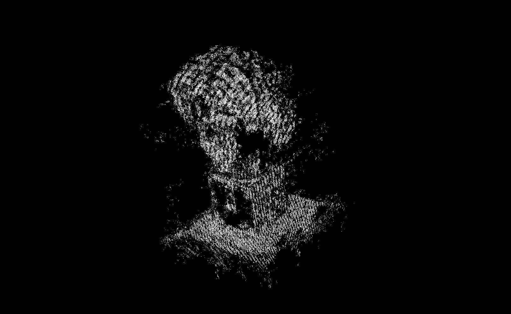

# 🧱 Homework 2: Structure from Motion (SfM)

This assignment implements key components of the Structure from Motion (SfM) pipeline. Given multiple images of a static object and their keypoint correspondences, the goal is to reconstruct the 3D point cloud and estimate the camera poses.

## 🧭 Objectives
- Estimate relative camera pose from the Essential Matrix.
- Reconstruct 3D points via linear and non-linear triangulation.
- Identify the correct pose from multiple candidate decompositions.
- Visualize the reconstructed scene.

---

## 📌 Problem Breakdown

### 1. Camera Pose from Essential Matrix (Problem 3.1)
- Computed the **Essential Matrix (E)** using known intrinsics.
- Applied **Singular Value Decomposition (SVD)** to decompose E into possible **rotation (R)** and **translation (T)** matrices.
- Four pose candidates were generated based on different combinations of R and T.

### 2. Linear 3D Points Estimation (Problem 3.2)
- Utilized **Direct Linear Transformation (DLT)** to triangulate 3D coordinates from matched 2D points.
- Constructed the system of linear equations based on projection matrices and solved using SVD.

### 3. Non-Linear 3D Points Estimation (Problem 3.3)
- Refined the linear estimates of 3D points using **Gauss-Newton optimization**.
- Minimized the reprojection error to achieve higher accuracy in the 3D reconstruction.
- Iteratively updated 3D point estimates to improve convergence.

### 4. Decide the Correct RT (Problem 3.4)
- Selected the correct R and T combination by checking which configuration results in 3D points with **positive depth** (z-coordinate) in both camera views.
- Projected the triangulated points to verify their physical plausibility.

---

## 📊 Results and Visualization

Below are sample results and visualizations of the reconstructed 3D scene using the final camera pose and optimized 3D points.

### 📌 3D Point Cloud Visualization
> _Insert your 3D point cloud visualization here_  

### 📌 Reprojection Accuracy
> _Optional: Add reprojection comparison or error plots here_

---

## 🧠 Observations & Insights
- The quality of 3D reconstruction heavily depends on the accuracy of keypoint matches and camera calibration.
- The Gauss-Newton method significantly improved reconstruction quality compared to linear triangulation.
- Selecting the correct pose among the four candidates is critical — incorrect R/T combinations produce 3D points behind the camera.

---

## 🛠️ Tools and Dependencies
- Python + NumPy
- Matplotlib for visualization
- OpenCV (optional, if used for keypoint processing)

---
